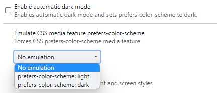
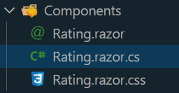

#Introduction

Recently I decided I needed to validate that I actually know what I _think_ I know, with respect to frontend technologies. Over recent years I've moved from being primarily a back end coder, knowing enough to interpret HTML & CSS, and build sites using a full CSS framework like Bootstrap, to someone who is more full stack focussed.

This has required me to learn a few front end tricks, and I feel that I've come a long way, with some front end design skills and particularly in strengthening my CSS chops. However whilst I've FELT that I've learnt a lot, I wanted a way to prove to myself that I have _actually_ learnt something. So I started looking for challenges online, and quickly came across [Frontend Mentor](https://frontendmentor.io).

The first challenge I decided to take on is their [Interactive Rating Component](https://www.frontendmentor.io/challenges/interactive-rating-component-koxpeBUmI). This is a pretty straightforward build, which really only requires basic Javascript for event handling and recording the rating the user selected.

# The Challenge

One of the parameters I set for myself with this was that I was primarily only interested in proving that I can build front end things using HTML and CSS. Therefore I don't really care about the Javascript behind it at this stage. Given that I have several years of experience using Blazor WASM at this point, and realising that there aren't a huge amount of demonstrations of Blazor in "mainstream" front end dev circles, I thought I'd mix this up by using Blazor rather than JS.

## Goals I set myself

Firstly, as mentioned already, I wanted to do this using Blazor WASM, because I'm very familiar with it and therefore the challenge for me would be solely in proving that I can build the structure and style it using CSS.

As a secondary goal, I also decided I wanted to incorporate a light/dark mode toggle of some sort, along with the corresponding color schemes. Because the challenge from Frontend Mentor is based around a dark scheme only, this would require me to come up with the colors for the light mode version myself.

# Light/Dark Mode

It's actually really easy to detect light/dark mode. In fact it's as simple as using a media query in CSS:

```CSS
@media (prefers-color-scheme: dark)
```

As per any other media query, you simply follow this with the rule updates you want to apply when this is detected.

## Implementing Light and Dark mode

So how do you then apply colors based on the different modes? Well, CSS custom properties to the rescue.

I won't go into too much detail as to what these are here, but as with all HTML and CSS related topics, MDN has a good reference [here](https://developer.mozilla.org/en-US/docs/Web/CSS/Using_CSS_custom_properties).

The first thing I did was to define the base colors I was going to use, as custom properties on the ```:root pseudo element.

```CSS
:root {
    ...

    --color-primary: hsl(25, 97%, 53%);
    --color-primary-disabled: hsla(25, 97%, 53%, 0.3);
    --color-white: white;
    --color-whitesmoke: whitesmoke;
    --color-light-grey: hsl(217, 12%, 63%);
    --color-light-grey-opacity-10: hsla(217, 12%, 63%, 0.1);
    --color-light-grey-disabled: hsla(217, 12%, 63%, 0.3);
    --color-medium-grey: hsl(216, 12%, 54%);
    --color-dark-blue: hsl(213, 19%, 18%);
    --color-very-dark-blue: hsl(216, 12%, 8%);
    --color-black: black;
}
```

> Yes, I know that those "blue" colors aren't actually very blue looking, but that's what they called those colors in the Frontend Mentor challenge so I ran with it :)

Next I defined variables for the color schemes using the colors I'd chosed for the _light_ scheme as the default. Following on from that, I use the media query to then modify the color scheme variables to suit the dark mode, when that is detected.

Given that most of the color variables are consistent across both light and dark modes, the dark mode changes are only a few:

```CSS

@media (prefers-color-scheme: dark) {
    :root {
        /* dark scheme color variables */
        --color-bg: var(--color-dark-blue);
        --color-fg: var(--color-white);
        --color-fg-disabled: var(--color-light-grey-disabled);
        --color-fg-inverse: var(--color-white);
        --body-bg: var(--color-very-dark-blue);
    }
}
```

## Testing Light/Dark Mode

I didn't go to the effort of providing an on-page switch to allow users to toggle between light and dark mode, but this can be done. One strategy, along with an in-depth discussion on light/dark mode and color theming can be found in [this article](https://web.dev/prefers-color-scheme/#dark-mode-but-add-an-opt-out).

So with my solution, to switch between the color schemes, I need to either use the Operating System light/dark mode toggle, or just use the Chrome dev tools to do it. This is done using the dev tools (F12 in chrome to open, of course), then use the menu at the far right of the toolbar and select "More Tools" and choose "Rendering". In the panel that opens at this point you can scroll down to "Enable automatic dark mode" (if you're using light mode already) or go down one further and look for "Enable CSS media feature prefers-color-scheme" and select the mode of your choice from the dropdown:



# Using Blazor instead of Javascript

The other notable characteristic of my solution to this problem is that I used Blazor Web Assembly to build it.

For anyone that isn't aware, Blazor is a framework from Microsoft that enables developers to use C# to build rich client apps that run in the browser. This was previously not possible, with Microsoft's earlier web frameworks (ASP.Net WebForms and MVC) both allowing devs to use C# but being dependent on running on a server.

Blazor WASM is unique in that it gives C# devs the opportunity to use their preferred language to build modern Single Page Application websites. It does this through the use of WebAssembly, so the code is running 100% in the browser.

One of the features that appeals to me with this framework is that it enables the developer to perform DOM manipulation without using JavaScript. Naturally, it's impossible in the real world to completely remove the need for JavaScript at this stage, but for something as simple as this project I decided to avoid using JavaScript completely.

There are three main logic components of this solution as I saw them. First, when the user selects their rating, we need to record it, so we can display it on the "thank you" content. Secondly, we needed to detect when they click the submit button, and display the "thank you" content to them. The third element is to change the style of the selected option once the user has clicked it.

As an addition, I also added in having the submit button disabled, and enabling it when we have received the user's rating.

## Implementing the Logic

Firstly, I implemented the rating card as a standalone component. Basically this entails creating a single file - a .razor file for the markup (and optionally the component's C# code). However, Blazor supports "CSS isolation" where each component can have it's own CSS styles, defined in a file named after the component.

As mentioned, there is an option to have the component's C# logic defined inside the .razor file, but I chose the alternative for this project (not that I really HAVE any C# logic) wherein a component has a _code behind_ file which contains the class definition and logic.

So my file structure looks like this:



The `Rating.razor.cs` file contains the C# code, but all that has is a partial class definition and two variables:

```csharp

using Microsoft.AspNetCore.Components;

namespace Blazor.Components
{
    public partial class Rating : ComponentBase
    {
        private int _rating;
        private bool _submitted;
    }
}
```

Where is the logic then? Well, one of the features of Blazor is that it uses Microsoft's Razor syntax, which has been around for a good decade or more, and supports a lot of conditional logic and so forth, in-line with the HTML markup. It's similar in a lot of ways to React's JSX syntax (I think, heh. I haven't actually done any React in anger).

Here's an example from the "thank you" content in my Rating component:

```html
<span class="selected-rating">You selected <span id="rating">@_rating</span> out of 5</span>
```

The `@_rating` in the middle of that `<span>` element tells Blazor to insert the value of the \_rating variable that I defined above, in the C# class in the code behind file.

This example actually shows how I insert the rating value the user selects into the "thank you" content of the card.

I set that value when the user clicks one of the rating value elements (which I have defined as `<li>` elementsin an unordered list), by executing a C# lambda function in response to the `Click` event:

```html

<ul class="rating-list">
    <li><span class="rating-item @(_rating == 1 ? "selected" : "")" onclick="@(() => { _rating = 1;})">1</span></li>
    <li><span class="rating-item @(_rating == 2 ? "selected" : "")" onclick="@(() => { _rating = 2;})">2</span></li>
    <li><span class="rating-item @(_rating == 3 ? "selected" : "")" onclick="@(() => { _rating = 3;})">3</span></li>
    <li><span class="rating-item @(_rating == 4 ? "selected" : "")" onclick="@(() => { _rating = 4;})">4</span></li>
    <li><span class="rating-item @(_rating == 5 ? "selected" : "")" onclick="@(() => { _rating = 5;})">5</span></li>
</ul>
```

The lambda function on each onclick simply sets \_rating to the respective value (1 through 5).

Note also that I have another lambda in the `class` attribute = this is adding the `.selected` class to the element if that rating is the one that the user has chosen. This takes care of adding and removing classes from the selected element as necessary when the user clicks a rating.

The final two pieces of logic relate to the submit button. I chose here to add a disabled attribute, so that the user can't submit before they've chosen a rating. This is taken care of by the lambda inside the `disabled` attribute's value in the following piece of code.

```html
<button class="submit-btn" disabled="@( _rating < 1 || _rating > 5)" onclick="@(() => { _submitted = true; })">Submit</button>
```

Finally, looking at the `onclick` definition of this button, there is another lambda, which this time sets the `_submitted` variable to `true`, indicating that the user has submitted their choice. Naturally, we use the value of the `_submitted` variable to determine whether to display the rating card or the thank you card:

```html
@if (_submitted == false) {
<div class="rating-card">...</div>
} else {
<div class="thankyou-card">...</div>
}
```

And there we have it. A simple Rating component, built using HTML & CSS, implementing light/dark modes with auto-detection, and including click and submit interactions without using Javscript, courtesy of Blazor WASM.

# Conclusion

Ok, this was a really trivial example, and I was easily able to do this in Blazor. However because I want to challenge myself, I think I'll continue to explore this "NoJS" approach and see how far I can push it by trying ever more complex scenarios and challenges.

## Solution repository

My code for this project can be found on Github [here](https://github.com/marklnz/blazorratingcard).

There is a live demo of my solution [here](https://markl.nz/BlazorRatingCard).
