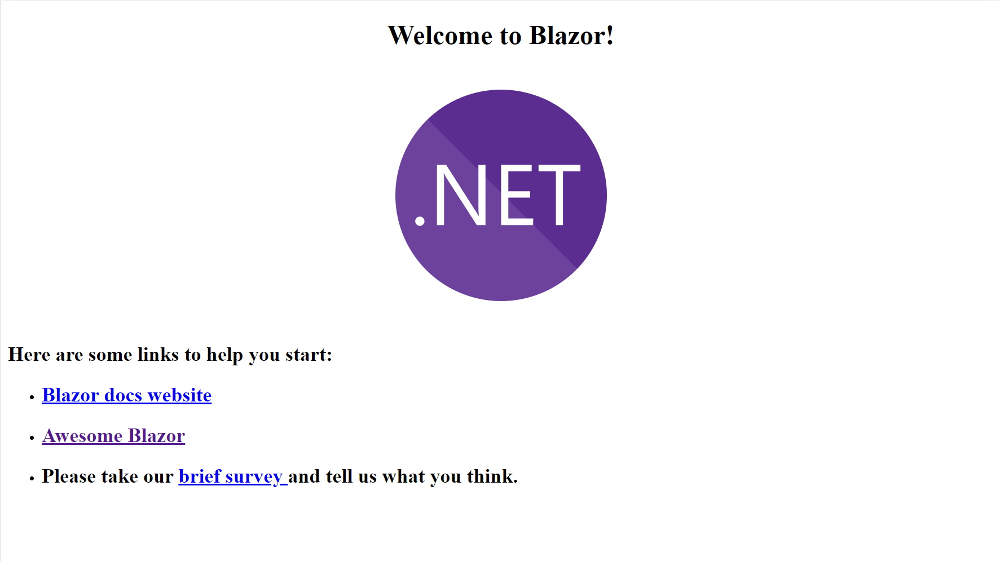
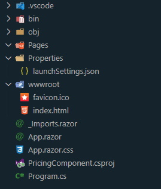

#Introduction

In my previous post ([Blazor Rating Card](https://markl.nz/blog/blazor-rating-card)) I discussed how I built a solution to one of the HTML/CSS challenges that [Frontend Mentor](https://frontendmentor.io) have on their website. I wanted to explore how I would go with writing the CSS from scratch, as that's not typically something I do, and I used my current favourite frontend framework, Blazor WebAssembly. As Blazor WASM is compiled to Web Assembly, it allows you to interact with the DOM using C# code, so I decided to see how far that extends, and what limitations there might be, by building the component using no hand-coded JavaScript at all. I say "no hand-coded JavaScript" because the Blazor WASM framework itself does use JS, but it's transparent to me. I'm interested in seeing how far I can go without needing to call JS to do DOM manipulation, event handlers, etc.

For this next challenge I chose to take on the [Interactive Pricing Component](https://www.frontendmentor.io/challenges/interactive-pricing-component-t0m8PIyY8). This is another pretty straightforward build, but it does step the CSS difficulty up a little by requiring both a "toggle" switch and a "slider" component.

# The Challenge

As mentioned, the challenge required me to build both a nice toggle switch, and a slider. Here's a screenshot of my completed solution:


I was pretty sure the toggle switch could be built with some fancy styling of a checkbox, and for the slider I was hoping to be able to style the HTML `<input type="range">` element. As it turned out, both of my guesses here were correct.

The trick was to find a way to do both without writing any custom JavaScript, as well as to find out what I could about how to style them both.

Unlike the previous component, there is no "next state" for this component. In other words, clicking the "Start my trial" button does not do anything. So there's less logic that needed to be implemented for this solution. However, the pricing shown does need to change depending on the position of the slider, and whether the Monthly/Yearly billing toggle is set to Monthly or Yearly.

# Project Structure

## Scaffolding the project

First things first, I set up a new Blazor WASM project. Rather than using Microsoft's default Blazor WASM template, with all it's default styling and so on, I wanted to start with essentially a blank slate. So I found and installed a third party Blazor WASM template that scaffolds a bare-bones Blazor site for you, with no extra JavsScript and no CSS.

It's built by a dev named J.Sakamoto, a Microsoft MVP from Japan, who has a bunch of cool projects on Github, including the [Awesome Blazor Browser](https://jsakamoto.github.io/awesome-blazor-browser). Also, check this out: [https://jsakamoto.github.io/](https://jsakamoto.github.io/) - it's a personal profile website with a _command line interface in the browser_.

Back to the template. You install it from a command line, using the `dotnet new` command:

```powershell
dotnet new -i Toolbelt.AspNetCore.Blazor.Minimum.Templates
```

The next step is to simply use it to scaffold a new project. I called my project "PricingComponent":

```powershell
dotnet new blazorwasmmin -n PricingComponent
```

This gives a project, set up to use Blazor WASM, with a bare-bones structure that includes nothing more than the minimum required to run and display a single page with a .net logo:



Here's a snippet of the scaffolded project structure.



As you can tell from the structure above, this template does not set up any pages at all - the folder is present but empty. So after re-enabling the Blazor routing in app.razor (the project setup helpfully includes instructions for doing this), I added an index.razor in the pages folder, along with an index.razor.cs code behind file, and an index.razor.css for the CSS styles for that page.

## Adding Components

Next up was to add some components. I decided to set up three components. This challenge is a fairly contrived example, but I imagined that a pricing component of this sort would be a good candidate for reuse in a real world project, so wanted to treat it that way.

I first created a components folder in my project, and created a "PricingCard" razor component in it. this would hold the HTML for the card itself, which would be included in my index.razor page like so (note the `<PricingCard></PricingCard>` element in the code below):

```html
@page "/" @using PricingComponent.Components

<div class="content-main">
    <div class="page-title">
        <h1>Simple, traffic-based pricing</h1>
        <div>
            <span>Sign-up for our 30-day trial.</span>
            <span>No credit card required.</span>
        </div>
    </div>

    <PricingCard></PricingCard>
</div>
```

The `PricingCard` component contains all the HTML and CSS for the "card" itself, except the actual slider and toggle, which are both separate components. I also included the logic for calculating the final price in this component, adding this to the component's C# code behind file.

The pricing card holds references to both the toggle and slider components, like so:

Toggle:

```html
<Toggle @bind-Value="_yearlyRate"></Toggle>
```

As can be seen here, the variable `_yearlyRate` is bound to the Toggle's Value parameter, using the `@bind-Value` directive.

Similarly, the Slider has a `Value` property, and this is bound to another variable in the PricingCard component, `_value`.

Slider:

```html
<Slider MinValue="1" MaxValue="5" Step="1" @bind-Value="_value"></Slider>
```

In addition, because, as we will see shortly, the Slider is simply a wrapper around a styled `<input type="range">` element, it expects `MinValue`, `MaxValue` and `Step` parameters to be set as well.

Now lets look at the structure of the toggle and slider components themselves.

## Toggle

The toggle is simple really - it's built around an HTML checkbox and it's label. relying on the fact that the checkbox state reacts to mouse clicks on the associated label, we apply a set of styles to the label itself, and just _hide_ the checkbox. Of course, we still need to be able to get the state of the checkbox so we can expose it from our component. So the HTML for the toggle looks like this:

```html
<input type="Checkbox" id="switch" checked="@Value" @onclick="ToggleClicked" /> <label for="switch">Toggle</label>
```

Pretty straightforward. The "checked" attribute is linked to the Toggle component's `Value` propertym and we provide a handler for the `onclick` handler also.

The CSS that handles the styling is relatively simple also, firstly hiding the checkbox itself:

```css
input[type='checkbox'] {
    height: 0;
    width: 0;
    visibility: hidden;
}
```

Next is the styling of the label. This relies on a `:after` pseudo element to help with creating the toggle's shape.

```css
label {
    cursor: pointer;
    text-indent: -9999px;
    width: 2.75em;
    height: 1.5em;
    background: var(--toggle-background);
    display: block;
    border-radius: 100px;
    position: relative;
    margin: 0 0.75em;
}

label:after {
    content: '';
    position: absolute;
    top: 0.25em;
    left: 0.25em;
    width: 1em;
    height: 1em;
    background: #fff;
    border-radius: 90px;
    transition: 0.3s;
}

label:active:after {
    width: 1.3em;
}
```

Notably here the `text-indent` property ensures that any text in the label is pushed way off the visible page, then we set a background colour, width, height, and a border radius to ensure that the sides of the box are curved nicely. We also set `position: relative` because the pseudo element is going to be positioned absolutely.

The `:after` pseudo element is used to display the circle in the toggle, and so is positioned just inside the top left of the control by default, with a `width` and `height` set so there is a small visible border just around the circle. Because these are both set to the same size also, we can set a `border-radius` such that the element is a full circle.

We also have styles to modify the background color when the toggle is switched:

```css
input:checked + label {
    background: var(--full-slider-bar);
}
```

And another to move the circle to the right of the toggle when checked also:

```css
input:checked + label:after {
    left: calc(100% - 0.25em);
    transform: translateX(-100%);
}
```

The final style rule effectively creates a subtle "stretch" to the circle in the toggle whilst it is in motion:

```css
label:active:after {
    width: 1.3em;
}
```

Once again, the logic encapsulated in this toggle is written in C#, and is contained in the coide behind file:

```csharp
public partial class Toggle : ComponentBase
{
    [Parameter]
    public bool Value { get; set; }

    [Parameter]
    public EventCallback<bool> ValueChanged { get; set; }

    private async Task ToggleClicked()
    {
        Value = !Value;
        await ValueChanged.InvokeAsync(Value);
    }
}
```

As I said earlier, this is a pretty simple component, and it simply provides `Value` and `ValueChanged` parameters in support of Blazor data binding, along with a handler for the checkbox's `onclick` event, which toggles the `Value` parameter and invokes the callback that is registered in `ValueChanged`, thereby notifying parent components of the change in `Value`.

## Slider

The Slider component is similar to the Toggle in that it's really just a wrapper around a standard HTML element. This time it's `<input type="range">`. this is normally rendered like so:

<input type="range" />

So I needed to do some pretty extensive styling on it, as the challenge required it to look like this:


It turns out that there are a couple of elements to the range input that can be styled - the thumb (the "grip" that is slid back and forth along the slider) and the track (the piece that the thumb slides along).

So it's a simple case of setting background colours, dimensions, border radii, etc. to get it looking right. In the case of the thumb, I added a background image as well as the colour, and a box shadow also.

This was one case where I had to make use of browser specific pseudo elements, as there is no (yet?) standard HTML approach for styling range inputs - each browser does it's own thing. Fortunately, unlike scroll bars, the browsers all seem to actually have equivalence in terms of what you can do, they just use different names.

```css
.slider-div {
    width: 100%;
}

.slider {
    -webkit-appearance: none;
    width: 100%;
    height: 0.75em;
    border-radius: 5px;
    background: var(--empty-slider-bar);
    outline: none;
    opacity: 0.7;
    -webkit-transition: 0.2s;
    transition: opacity 0.2s;
    cursor: pointer;
    background-size: 50%;
    background-image: linear-gradient(var(--full-slider-bar), var(--full-slider-bar));
    background-repeat: no-repeat;
    vertical-align: middle;
}

/* Mouse-over effects */
.slider:hover {
    opacity: 1; /* Fully shown on mouse-over */
}

/* The slider handle */

.slider::-webkit-slider-thumb {
    -webkit-appearance: none;
    appearance: none;
    width: 3em;
    height: 3em;
    border-radius: 50%;
    background: url('images/icon-slider.svg');
    background-repeat: no-repeat;
    background-position: center;
    background-color: var(--slider-background);
    cursor: pointer;
    box-shadow: 0 1em 2.5em var(--slider-background);
}

.slider::-moz-range-thumb {
    width: 3em;
    height: 3em;
    border-radius: 50%;
    background: url('images/icon-slider.svg');
    background-repeat: no-repeat;
    background-position: center;
    background-color: var(--slider-background);
    cursor: pointer;
}

.slider::-webkit-slider-runnable-track {
    -webkit-appearance: none;
    box-shadow: none;
    border: none;
    background: transparent;
}

.slider::-moz-range-track {
    -webkit-appearance: none;
    box-shadow: none;
    border: none;
    background: transparent;
}
```

The one aspect of styling a range input that is not so obvious, however, is how to dynamically colour the "filled in" background on the track - the default implementation in most browsers fills the portion between the start of the track and the thumb, and I needed to replicate that. Unfortunately there is no obvious "easy" way to do this, so I used a background on the slider class build using a "gradient" (actually just using the same colour for start and end colours). I can control the coverage of the track by adjusting the `background-size`. As long as the "x percentage" is correctly synchronised with the position of the thumb, it works as I need it to. So the question then is how to do this, given that I can't change the CSS on the fly with C# in Blazor (nor with JavaScript, as far as I know)?

There were a couple of solutions I thought about. One option might be to create a separate CSS class for each position, as I only have a few to worry about in this example, and apply the correct one depending on the position of the thumb. But that wouldn't scale well for even a dozen steps on the range input. The other option I had was to apply an inline style to the range input, and set that according to the position of the slider.

That's the option I went with in the end, as it's something I can easily tie to a C# variable or function in the component, which I update every time the position of the thumb is changed.

The HTML code for the element therefore looks like this:

```html
<input type="range" min="@MinValue" max="@MaxValue" value="@Value" step="@Step" style="background-size: @GetPercentage()" class="slider" id="myRange" @oninput="HandleInputChange" />
```

You can see from this that the `style` attribute is setting the `background-size` to the value returned from a function I've named `GetPercentage()`.

The code for this function looks like this:

```csharp
private string GetPercentage()
{
    int percentage = (Value - MinValue) * 100 / (MaxValue - MinValue);
    return $"{percentage}%";
}
```

This is simply taking the distance across the range input that the current value is `(Value - MinValue)` (multiplied by 100) and dividing it by the total length of the track, to get a percentage.

This works through the magic of Blazor since the component is re-rendered whenever `Value` changes (because I have bound Value to the `value` attribute of the range input), and as the range input cannot be rendered without Blazor first calling GetPercentage() in order to provide a value for the `style` attribute, that percentage is effectively updated every time the range input's value is changed.

The remainder of the C# logic in the code behind is related to notifying the parent component that the input's value changed, and is effectively the same as the code that performs the same function in the toggle.

## Price Calculation Logic (PricingCard Component)

Determining which price to show was again pretty straightforward. In the `PricingCard` component's code behind, I have functions that determine what the "Page views" text and the "Price per month" text should both be.

The page views text is inserted inline in a span whenever the page is rendered, by calling the `GetPageViewCountFromSliderValue()` method, passing the result to the `FormatNumber()` function to get a textual representation in the required format.

```html
<span class="page-views">@FormatNumber(GetPageViewCountFromSliderValue(_value)) PAGEVIEWS</span>
```

The code for these two functions is as follows:

```csharp
private string FormatNumber(int num)
{
    if (num >= 1000000)
        return (num / 1000000D).ToString("0.#") + "M";
    else if (num >= 100000)
        return (num / 1000).ToString() + "K";
    else if (num >= 1000)
        return (num / 1000D).ToString("0.#") + "K";
    else
        return num.ToString("#,0");
}

private int GetPageViewCountFromSliderValue(int sliderValue) => sliderValue switch
{
    1 => 10000,
    2 => 50000,
    3 => 100000,
    4 => 500000,
    5 => 1000000,
    _ => 0
};
```

So really just some simple integer to string formatting in `FormatNumber()` and I'm using the value from the Slider component (an integer from 1 to 5) and translating that to an integer that represents the page count number at each step, in the `GetPageViewCountFromSliderValue()` function.

Similarly, the result of a call to the function `CalculatePricePerMonth()` is inserted inline in a span to display the price:

```html
<span class="headline-price">$@CalculatePricePerMonth(_value)</span>
```

The code for this function is also pretty simple, again taking the value (1-5) from the slider and translating that to a price. I'm also using the value in the variable `_yearlyRate` to test whether to additionally apply a 25% discount to that price. Remembering that `_yearlyRate` is set based on the value of the Switch component:

```csharp
private string CalculatePricePerMonth(int sliderValue) => sliderValue switch
{
    1 => (8.00m * (_yearlyRate ? .75m : 1)).ToString("0.00"),
    2 => (12.00m * (_yearlyRate ? .75m : 1)).ToString("0.00"),
    3 => (16.00m * (_yearlyRate ? .75m : 1)).ToString("0.00"),
    4 => (24.00m * (_yearlyRate ? .75m : 1)).ToString("0.00"),
    5 => (36.00m * (_yearlyRate ? .75m : 1)).ToString("0.00"),
    _ => "0.00"
};
```

# Conclusion

So again, this was another pretty simple example, that was relatively easy to achieve using Blazor. I'm going to continue to explore this "NoJS" approach and see how far I can push it by trying ever more complex scenarios and challenges, both some of the higher level scenarios from Frontend Mentor, plus one or two of my own creation.

## Solution repository

My code for this project can be found on Github [here](https://github.com/marklnz/interactivepricingcomponent).

There is a live demo of my solution [here](https://markl.nz/InteractivePricingComponent).
