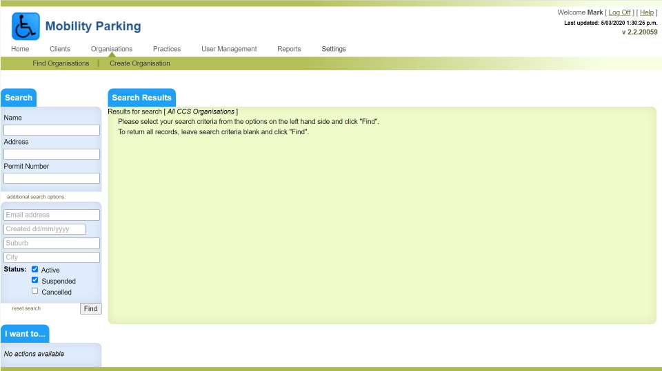

# Mobility Parking Permits

## Overview

The Mobility Parking Permits application is used by an organisation called CCS Disability Action to manage applications for permits allowing eligible drivers to park in disabled person's parking spots.

There are two components of the application. A back-office application provides application forms (online and downloadable), validation of eligibility by medical practitioners, the issuing of permits and integration with a third party card printing bureau to print and dispatch cards to approved applicants. The other component is a public website that allows permit holders to request and pay for a renewal of their permit.

## Technical overview

Both components of the Mobility Parking Permits application are "legacy" .net projects, running on the .net 4.8 framework. The project was built using ASP.Net MVC, and Entity Framework, and is written in C#. It is architected as a "monolith" style application with a web based client application posting requests to an IIS web server, with data being stored in a single MS SQL Server database.

## My Involvement

The initial release of the CCS project was done in 2013, shortly after I started at Eyede Solutions as Development Team Lead. I took over implementation of the project from a developer whose contract ended 2 months after I started. I was responsible for overseeing the deployment of the back office component of the solution, as well as then building the public facing renewal site. I had sole responsibility for the architecture and development of the public site.

In 2018, work began on a replacement for the Mobility Parking Permits application, to be built using a more modern architecture and technology stack. My team built the replacement using Angular, with .net Web APIs for backend services. I was not directly involved in this work, however as the development team lead I was responsible for overseeing the work of the team, and ensuring that the new application met the needs of the customer.
