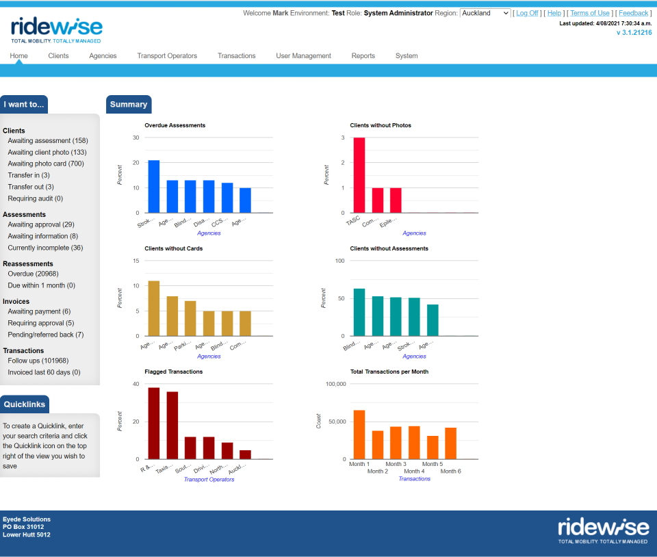

# Ridewise

## Overview

Ridewise is an application that supports Regional Councils in New Zealand in their efforts to support people with mobility impairments which mean they have trouble taking public transport. Ridewise is specifically built with the New Zealand Government's Total Mobility scheme in mind. This scheme allows eligible members of the public to take taxi trips at a discounted rate, as they are generally unable to ride on public transport due to a mobility impairment.

Packaged as a single, integrated electronic system that connects councils, community organisations and taxi operators, Ridewise:

-   allows councils to maintain accurate, up-to-date records of clients, agencies, taxi operators and taxi drivers
-   ensures that only authorised parties have access to these records
-   captures, full details of all Total Mobility trips
-   provides a full suite of reporting services
-   offers online application and assessment forms for Total Mobility clients
-   enables online invoicing and payment authorisations between councils and taxi operators
-   incorporates automated business rules designed to highlight fare refunds that may have been fraudulently claimed

## Technical overview

Ridewise 1 is a "legacy" .net project, running on the .net 4.8 framework. It is built using ASP.Net MVC, and Entity Framework 6, and is written in C#. It is architected as a "monolith" style application with a web based client application posting requests to an IIS web server, with data being stored in a single MS SQL Server database.

## My Involvement

Ridewise was released to its launch customer, Environment Canterbury, in 2014. The project was originally conceived in 2012 as an enhanced UI upon an older codebase. When I began as Development Team Lead at Eyede Solutions in 2013, the project had been shelved due to lack of customer demand, and the original development team had all left the company.

Late in 2013 interest in the project picked up again and I led the team that completed the implementation. Throughout the intervening years, I maintained responsibility for support and ehancement of Ridewise, which has required quite a significant effort over the years. Several major enhancements were made to improve the application's performance and responsiveness in light of ever increasing numbers of tenants, users and transactions.

Ridewise is earmarked for replacement by the [Ridewise 2 project](../ridewise-2).
