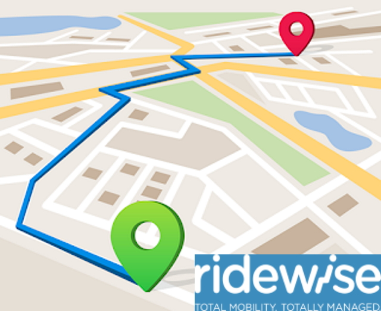

# Ridewise 2

## Overview

The Ridewise 2 project was initially conceived as a way for the New Zealand Government department responsible for the Total Mobility scheme to take more direct control of the processing of Total Mobility refund claims from the taxi operators. 

Ridewise 2 was to be built around a real-time trip update process, where trips taken by users of the Total Mobility scheme would be sent from the taxi directly, as they are taken. This differs from Ridewise 1 where trips are uploaded afterwards, often overnight in batches, by the taxi operators. This batch process in Ridewise 1 is time consuming and error prone, as many of the operators use copy+paste to build the trip data files before sending them. 

Along the way, Ridewise 2 was intended to also improve the reliability and performance of the user interface, as the existing Ridewise 1 application is slow, and contains elements of less than optimal usibility. 

Thus, it was decided to write a ground up replacement for Ridewise 1, utilising a more advanced and scalable architecture, along with a modern user experience. 

## Technical Overview

Ridewise 2 is built using the latest .net framework, .net 6. It is designed around a microservices architecture hosted on Microsoft Azure, with a separate API for real time trip data. 

The services are all built in C# as ASP.Net Core WebAPIs, each with their own independent Azure SQL database, and use an event-driven approach to domain data persistence. Service to service communication is performed using a RabbitMQ message queue server as an event hub, and all services expose RESTful service interfaces. 

The web client is built using C# with Microsoft's Blazor Web Assembly SPA framework, again on .net 6. 

## My Involvement

Having been technical lead of the [Ridewise 1](./ridewise-1) project since 2013, I was seen as the obvious person to also lead the replacement project.   

I was initially tasked with designing the real time trip processing API, which in fact was ultimately deployed to production in 2019 for use in speeding up trip processing for Ridewise _1_. At this point, there was little appetite from existing customers for a full replacement application, so the process of attempting to find new customers began. My part in this included a trip to Australia to present the Ridewise concept to the government of the state of Victoria. This, along with a number of expressions of interest from other customers in New Zealand, ultimately led to Ridewise 2 being designed as a modular, multi-tenant application. 

Development began with this design in mind, however the sales pipeline dried up and so the focus of the application was narrowed to the original scope of simply replacing Ridewise 1 with a more performant, more scalable and future proof application. 

I have been involved since the beginning of the project, as the architect, UI designer, and lead developer for the team. Ridewise 2 is scheduled for release in 2022. 
